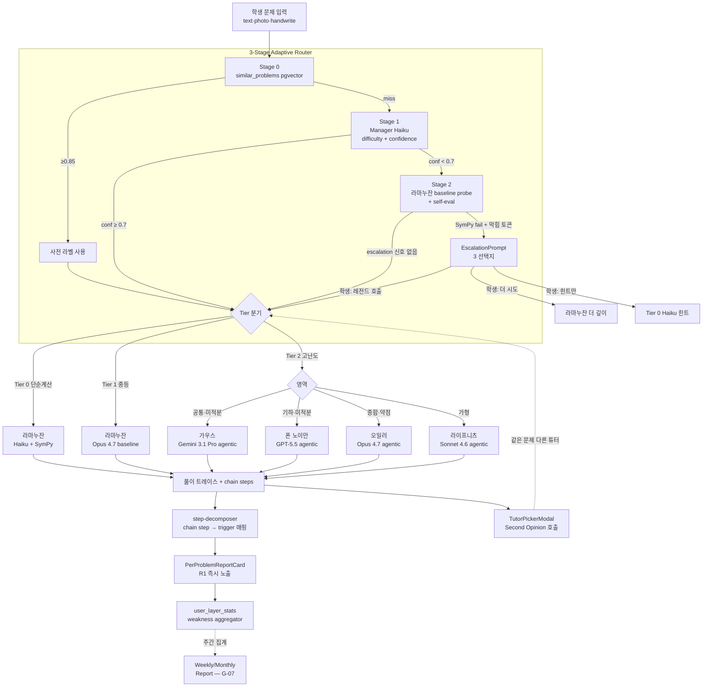
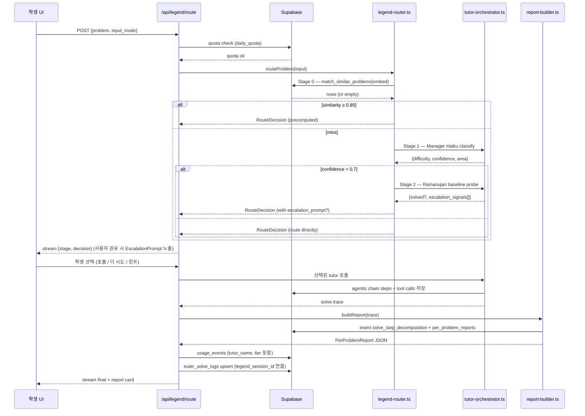

# Phase G-06 — Legend Tutor 라우터 + Per-Problem Report 아키텍처

> 작성일: 2026-04-28 (9차 세션 진입)
> 전제: Phase A~G-05c 완료. KPI 85% 게이트 통과 (Gemini 3.1 Pro agentic 89.5% / GPT-5.5 agentic 86.8%).
> 격리 원칙: 신규 코드는 `src/app/legend/*`, `src/app/api/legend/*`, `src/lib/legend/*`, `src/components/legend/*`, `supabase/migrations/2026_06_*` 범위로 한정. MindPalace/English/Conversation/기존 Euler 무영향. 본 문서의 모든 결정은 `docs/project-decisions.md` 2026-04-28 항목과 정합.

---

## 1. 요약 + 가치 축

### 1.1 본질 — 풀이는 commodity, trigger 학습은 moat

GPT-5/Gemini 4가 풀이를 commodity로 만들 때, **"이 학생이 어떤 trigger를 못 떠올렸는가"** 는 우리만의 누적 데이터로만 만들 수 있는 해자다. Phase G-06는 두 축을 동시에 키운다.

- **상단 축 (5-튜터 라우팅)**: 학계 천장 75~85% 를 89.5% 로 돌파한 모델 격차를 그대로 학생에게 직접 노출. "거장 4인의 강의를 골라 듣는 학습 경험".
- **하단 축 (Per-Problem Report v1)**: 매 풀이를 trigger 단위로 분해 저장 → 즉시 학생에게 "어느 단계가 가장 어려웠는가 / 같은 trigger의 다른 도구는 무엇인가" 카드 노출.

두 축은 데이터로 연결된다. 라우터 선택 결과가 곧 리포트의 step decomposition 입력이다.

### 1.2 한 장 다이어그램 (5-튜터 + 3-Stage + R1)



---

## 2. 시스템 다이어그램 (데이터 흐름)



---

## 3. DB 스키마 변경안

### 3.1 결정 — Rename ✗, Namespace 추가 ○

**근거**:
1. 기존 17 마이그레이션 + 베타 사용자 데이터(`euler_solve_logs`, `user_layer_stats`, `user_skill_stats`)가 이미 운영 중. 테이블 rename은 RLS 정책·인덱스·외부 RPC(`match_similar_problems`)·코드 30+ 파일을 동시에 깨뜨림.
2. `legend_*` 명칭은 라우팅·세션·리포트 영역의 **신규 개념** 만 차지. 기존 `euler_*` 는 "풀이 로그/약점 통계"로 의미 충돌 없이 공존 가능.
3. UI 카피·도메인(`/legend/*`)만 사용자 노출. 내부 테이블 명칭은 사용자가 보지 않음. rename 비용 ≫ 일관성 이득.
4. Phase H 학습지 통합 진입 시 별도 namespace(`learning_*`) 추가 패턴을 본 결정으로 일반화.

**정책**:
- 신규 개념 (라우팅 / 튜터 세션 / 리포트 / quota) → `legend_*` 신규 테이블
- 기존 풀이 트레이스 / 약점 통계는 `euler_*` 그대로 유지, 컬럼만 추가

### 3.2 마이그레이션 목록 (8개)

| 파일 | 목적 |
|---|---|
| `20260601_legend_routing_decisions.sql` | 라우팅 결정 로그 |
| `20260602_legend_tutor_sessions.sql` | 튜터 세션 (1 problem ↔ N tutor calls) |
| `20260603_legend_quota_counters.sql` | 5종 quota 통합 카운터 (Δ1) |
| `20260604_solve_step_decomposition.sql` | trigger 단위 step 분해 + LLM struggle (Δ3) |
| `20260605_per_problem_reports.sql` | R1 캐시 |
| `20260606_solve_reasoning_trees.sql` | ToT 시각화 데이터 (Δ4) |
| `20260607_alter_usage_events_legend.sql` | 기존 usage_events 컬럼 추가 |
| `20260608_alter_euler_solve_logs_legend.sql` | 기존 euler_solve_logs 컬럼 추가 |

### 3.3 신규 테이블 5종

#### `legend_routing_decisions`

```sql
create table legend_routing_decisions (
  id uuid primary key default gen_random_uuid(),
  user_id uuid not null references auth.users(id) on delete cascade,
  problem_hash text not null,                    -- problem_text sha256 (중복 라우팅 캐시 키)
  stage_reached smallint not null check (stage_reached in (0,1,2)),
  stage0_similar_id uuid references similar_problems(id),
  stage0_similarity real,
  stage1_difficulty smallint check (stage1_difficulty between 1 and 6),
  stage1_confidence real check (stage1_confidence between 0 and 1),
  stage1_area text,
  stage2_probe_solved boolean,
  stage2_signals text[] not null default '{}',  -- ['sympy_fail','stuck_token']
  routed_tier smallint not null check (routed_tier in (0,1,2)),
  routed_tutor text not null check (routed_tutor in
    ('ramanujan_calc','ramanujan_intuit','gauss','von_neumann','euler','leibniz')),
  user_chose_escalation boolean,                -- null=미권유, true/false=권유 후 응답
  duration_ms integer,
  created_at timestamptz not null default now()
);
create index legend_routing_user_idx on legend_routing_decisions(user_id, created_at desc);
create index legend_routing_hash_idx on legend_routing_decisions(problem_hash);
alter table legend_routing_decisions enable row level security;
create policy "legend_routing_read_own" on legend_routing_decisions for select using (auth.uid() = user_id);
create policy "legend_routing_insert_own" on legend_routing_decisions for insert with check (auth.uid() = user_id);
```

#### `legend_tutor_sessions`

```sql
create table legend_tutor_sessions (
  id uuid primary key default gen_random_uuid(),
  user_id uuid not null references auth.users(id) on delete cascade,
  routing_decision_id uuid references legend_routing_decisions(id),
  problem_hash text not null,                    -- 같은 문제 multi-tutor 호출 그룹핑
  tutor_name text not null check (tutor_name in
    ('ramanujan_calc','ramanujan_intuit','gauss','von_neumann','euler','leibniz')),
  tier smallint not null check (tier in (0,1,2)),
  call_kind text not null default 'primary'
    check (call_kind in ('primary','second_opinion','retry')),
  model_id text not null,                        -- 'claude-opus-4-7-20260201' 등
  mode text not null check (mode in ('baseline','agentic_5step','calc_haiku')),
  trace_jsonb jsonb,                             -- agentic turns + tool calls (raw)
  final_answer text,
  is_correct boolean,
  duration_ms integer,
  created_at timestamptz not null default now()
);
create index legend_sessions_problem_idx on legend_tutor_sessions(problem_hash, user_id);
create index legend_sessions_user_idx on legend_tutor_sessions(user_id, created_at desc);
alter table legend_tutor_sessions enable row level security;
create policy "legend_sessions_read_own" on legend_tutor_sessions for select using (auth.uid() = user_id);
create policy "legend_sessions_insert_own" on legend_tutor_sessions for insert with check (auth.uid() = user_id);
```

#### `legend_quota_counters` (Δ1 — 5종 통합)

> 단일 테이블에 5종 quota 통합. quota_kind enum 으로 분기. 베타·유료 한도는 환경변수/plan lookup 으로 외부화.

```sql
create table legend_quota_counters (
  user_id uuid not null references auth.users(id) on delete cascade,
  quota_kind text not null check (quota_kind in (
    'problem_total_daily',      -- 하루 총 문제 입력 수
    'legend_call_daily',        -- 하루 Tier 2 호출 수 (튜터 변경 재호출 동일 소진)
    'report_per_problem_daily', -- 하루 R1 생성 수
    'weekly_report',            -- 주간 R2 (생성 시 +1, 자격 게이트: 누적 풀이 ≥ 10)
    'monthly_report'            -- 월간 R2 (생성 시 +1, 자격 게이트: 누적 풀이 ≥ 20)
  )),
  period_start date not null,   -- KST 자정 기준 일/주(월요일)/월(1일) 시작일
  count integer not null default 0,
  primary key (user_id, quota_kind, period_start)
);
create index legend_quota_period_idx on legend_quota_counters(period_start desc);
alter table legend_quota_counters enable row level security;
create policy "legend_quota_read_own" on legend_quota_counters for select using (auth.uid() = user_id);
create policy "legend_quota_upsert_own" on legend_quota_counters for all using (auth.uid() = user_id);

-- 동시성 안전: atomic UPSERT increment
create or replace function increment_legend_quota(
  p_user_id uuid, p_quota_kind text, p_period_start date
) returns integer language plpgsql as $$
declare
  new_count integer;
begin
  insert into legend_quota_counters(user_id, quota_kind, period_start, count)
    values (p_user_id, p_quota_kind, p_period_start, 1)
    on conflict (user_id, quota_kind, period_start)
    do update set count = legend_quota_counters.count + 1
    returning count into new_count;
  return new_count;
end;
$$;

-- 자격 게이트: 누적 풀이 수 조회 (legend_tutor_sessions distinct problem_hash)
create or replace function get_lifetime_problem_count(p_user_id uuid)
returns integer language sql stable as $$
  select count(distinct problem_hash)::integer
  from legend_tutor_sessions
  where user_id = p_user_id;
$$;
-- weekly_report 자격: get_lifetime_problem_count >= 10
-- monthly_report 자격: get_lifetime_problem_count >= 20
```

#### `solve_step_decomposition` (Δ3 LLM struggle 컬럼 추가)

> **trigger 단위 step 매핑**이 R1 의 핵심. chain step → trigger 1:1 또는 1:N 매핑 + 학생 막힘 신호 + **LLM 자체 struggle 신호** 기록.

```sql
create table solve_step_decomposition (
  id uuid primary key default gen_random_uuid(),
  session_id uuid not null references legend_tutor_sessions(id) on delete cascade,
  euler_log_id uuid references euler_solve_logs(id),  -- 기존 로그와 연결
  step_index smallint not null,                  -- 0-based
  step_kind text not null check (step_kind in
    ('parse','domain_id','forward','backward','tool_call','computation','verify','answer')),
  step_summary text not null,                    -- 학생 친화 1줄 요약
  trigger_id uuid references math_tool_triggers(id),
  tool_id text references math_tools(id),
  difficulty smallint check (difficulty between 1 and 6),
  is_pivotal boolean not null default false,     -- "가장 어려운 단계" 마킹
  time_ms integer,                               -- 이 step 소요 시간
  -- 학생 막힘 추적
  user_stuck_ms integer,                         -- 학생 입력 정지 시간
  user_revisit_count smallint not null default 0,-- 학생이 이 step 재조회 횟수
  -- LLM struggle 추적 (Δ3)
  llm_turns_at_step smallint,                    -- 이 step 도달까지 agentic turn 수
  llm_tool_retries smallint not null default 0,  -- 이 step에서 tool 재호출 횟수
  llm_reasoning_chars integer,                   -- 이 step의 reasoning 길이
  llm_step_ms integer,                           -- 이 step 처리에 LLM이 소요한 ms
  llm_resolution_text text,                      -- "어떻게 해결했나" 1~2문장 (Haiku 요약)
  created_at timestamptz not null default now()
);
create index step_decomp_session_idx on solve_step_decomposition(session_id, step_index);
create index step_decomp_trigger_idx on solve_step_decomposition(trigger_id);
alter table solve_step_decomposition enable row level security;
create policy "step_decomp_read_own" on solve_step_decomposition for select using (
  exists(select 1 from legend_tutor_sessions s where s.id = session_id and s.user_id = auth.uid())
);
create policy "step_decomp_insert_own" on solve_step_decomposition for insert with check (
  exists(select 1 from legend_tutor_sessions s where s.id = session_id and s.user_id = auth.uid())
);
```

#### `solve_reasoning_trees` (Δ4 ToT 시각화)

> **추론 트리 = R1 의 결정적 차별화**. recursive-reasoner / alternatingChain trace 를 다중 부모 DAG 로 변환 저장. session 1:1.

```sql
create table solve_reasoning_trees (
  id uuid primary key default gen_random_uuid(),
  session_id uuid not null unique references legend_tutor_sessions(id) on delete cascade,
  user_id uuid not null references auth.users(id) on delete cascade,
  tree_jsonb jsonb not null,                     -- ReasoningTree { nodes, edges, root_id, conditions }
  depth_max smallint not null,                   -- 트리 최대 깊이
  node_count smallint not null,
  branching_factor real,                         -- 평균 자식 수
  generated_at timestamptz not null default now()
);
create index reasoning_trees_user_idx on solve_reasoning_trees(user_id, generated_at desc);
alter table solve_reasoning_trees enable row level security;
create policy "trees_read_own" on solve_reasoning_trees for select using (auth.uid() = user_id);
create policy "trees_upsert_own" on solve_reasoning_trees for all using (auth.uid() = user_id);
```

#### `per_problem_reports` (R1 캐시)

```sql
create table per_problem_reports (
  id uuid primary key default gen_random_uuid(),
  user_id uuid not null references auth.users(id) on delete cascade,
  session_id uuid not null references legend_tutor_sessions(id) on delete cascade,
  problem_hash text not null,
  report_jsonb jsonb not null,                   -- PerProblemReport (섹션 5 schema)
  expansion_trigger_ids uuid[] not null default '{}', -- 같은 trigger 다른 도구 추천
  -- 캐시 정책: report 는 한 session 당 1회 생성 후 재사용
  generated_at timestamptz not null default now(),
  -- 학생 인터랙션 (리포트 진입 후 어떤 카드를 펼쳤는지)
  expanded_steps smallint[] not null default '{}',
  expanded_triggers uuid[] not null default '{}'
);
create unique index per_problem_reports_session_uniq on per_problem_reports(session_id);
create index per_problem_reports_user_idx on per_problem_reports(user_id, generated_at desc);
alter table per_problem_reports enable row level security;
create policy "reports_read_own" on per_problem_reports for select using (auth.uid() = user_id);
create policy "reports_upsert_own" on per_problem_reports for all using (auth.uid() = user_id);
```

### 3.4 기존 테이블 컬럼 추가

```sql
-- 20260606_alter_usage_events_legend.sql
alter table usage_events
  add column if not exists tutor_name text,
  add column if not exists tier smallint check (tier in (0,1,2));
-- (NULL 허용. 비-Legend 이벤트는 NULL 유지)

-- 20260607_alter_euler_solve_logs_legend.sql
alter table euler_solve_logs
  add column if not exists legend_session_id uuid references legend_tutor_sessions(id),
  add column if not exists tutor_name text,
  add column if not exists tier smallint;
create index if not exists euler_logs_session_idx on euler_solve_logs(legend_session_id)
  where legend_session_id is not null;
-- 기존 코드는 NULL 으로 무영향. 신규 풀이부터 채워짐.
```

### 3.5 데이터 호환·이전 정책

- **베타 사용자 데이터 무손실**: 기존 `euler_solve_logs` 행은 `legend_session_id` NULL 로 유지. R2 (G-07) 약점 집계는 `tutor_name` IS NULL 행도 통계에 포함.
- **기존 `/euler` 라우트는 internal redirect**: 섹션 8 참조. 즉, 기존 베타 사용자가 즐겨찾기로 들어와도 `/legend/*` 로 자동 전환. 풀이 로그는 양쪽 모두에서 같은 테이블에 누적.
- **마이그레이션 순서**: 모든 ALTER 는 `add column if not exists` 로 idempotent. 7개 파일 순서 적용 후 즉시 production 가능 (downtime 0).

---

## 4. 라우팅 모듈 인터페이스 (`src/lib/legend/`)

> 모든 함수는 server-only. AI SDK v4 `generateText` + Supabase server client 사용. 토큰·테스트 효율을 위해 외부 의존 (LLM, DB) 은 주입 가능한 인터페이스로 한정.

### 4.1 공통 타입 (`src/lib/legend/types.ts`)

```ts
export type TutorName =
  | 'ramanujan_calc'   // Tier 0: Haiku + SymPy
  | 'ramanujan_intuit' // Tier 1: Opus 4.7 baseline
  | 'gauss'            // Tier 2: Gemini 3.1 Pro agentic
  | 'von_neumann'      // Tier 2: GPT-5.5 agentic
  | 'euler'            // Tier 2: Opus 4.7 agentic
  | 'leibniz';         // Tier 2: Sonnet 4.6 agentic

export type Tier = 0 | 1 | 2;
export type ProblemArea = 'common' | 'calculus' | 'geometry' | 'probability' | 'algebra';

export interface RouteInput {
  user_id: string;
  problem_text: string;
  problem_image_url?: string;
  input_mode: 'text' | 'photo' | 'handwrite' | 'voice';
  embedding?: number[];           // 사전 계산되어 있으면 재사용
}

export interface RouteDecision {
  stage_reached: 0 | 1 | 2;
  routed_tier: Tier;
  routed_tutor: TutorName;
  area?: ProblemArea;
  confidence?: number;
  precomputed_triggers?: TriggerLabel[];   // Stage 0 hit 시
  escalation_prompt?: EscalationPrompt;    // Stage 2 escalation 신호 시 set
  routing_decision_id: string;             // legend_routing_decisions.id
  duration_ms: number;
}

export interface EscalationPrompt {
  signals: ('sympy_fail' | 'stuck_token')[];
  message: string;                         // 학생 노출 카피
  options: Array<{
    kind: 'escalate' | 'retry' | 'hint_only';
    label: string;
    target_tutor?: TutorName;              // escalate 시 추천 튜터
  }>;
}
```

### 4.2 모듈 시그니처

```ts
// src/lib/legend/legend-router.ts
export async function routeProblem(input: RouteInput): Promise<RouteDecision>;
//   Stage 0 → Stage 1 → Stage 2 흐름 통합. legend_routing_decisions insert 후 RouteDecision 반환.
//   Stage 2 escalation 신호 시 routed_tutor='ramanujan_intuit' (probe 그대로 사용 가능)
//   + escalation_prompt 채움. 학생 응답은 별도 /api/legend/escalate 엔드포인트.

// src/lib/legend/stage0-similar.ts
export async function matchSimilarProblem(
  embedding: number[],
  threshold = 0.85,
): Promise<{ row: SimilarProblemRow; triggers: TriggerLabel[] } | null>;
//   match_similar_problems RPC 호출. similarity ≥ threshold 일 때만 hit.

// src/lib/legend/stage1-manager.ts
export async function classifyDifficulty(
  problem: string,
  area_hint?: string,
): Promise<{ difficulty: 1|2|3|4|5|6; confidence: number; area: ProblemArea }>;
//   Haiku 4.5 JSON 출력. 기존 src/lib/euler/manager 의 difficulty-classifier 재활용 가능.

// src/lib/legend/stage2-probe.ts
export interface ProbeResult {
  solved: boolean;
  trace_jsonb: unknown;
  escalation_signals: ('sympy_fail' | 'stuck_token')[];
  duration_ms: number;
}
export async function runRamanujanProbe(problem: string): Promise<ProbeResult>;
//   Opus 4.7 baseline 1회 호출. SymPy 검증 포함. self-eval 프롬프트로 "막힘" 토큰 출력 강제.

// src/lib/legend/escalation-detector.ts
export function detectEscalation(probe: ProbeResult): EscalationPrompt | null;
//   sympy_fail AND stuck_token 둘 다일 때만 권유 (자동 escalate ✗).
//   message: "라마누잔이 이 문제에서 막힘을 보입니다. 어떻게 할까요?"
//   options: [escalate(target=area별 추천), retry, hint_only]

// src/lib/legend/tutor-orchestrator.ts
export interface TutorCallInput {
  user_id: string;
  problem_text: string;
  tutor: TutorName;
  call_kind: 'primary' | 'second_opinion' | 'retry';
  routing_decision_id: string;
  prior_session_ids?: string[];   // second_opinion 시 비교용
}
export interface TutorCallResult {
  session_id: string;
  trace_jsonb: unknown;
  final_answer: string;
  duration_ms: number;
}
export async function callTutor(input: TutorCallInput): Promise<TutorCallResult>;
//   tutor → (model, mode) 매핑 후 적절한 callModel (eval-kpi 의 패턴 재사용) 호출.
//   legend_tutor_sessions insert + trace 저장.

// src/lib/legend/quota-manager.ts (Δ1 — 5종 통합)
export type QuotaKind =
  | 'problem_total_daily'
  | 'legend_call_daily'
  | 'report_per_problem_daily'
  | 'weekly_report'
  | 'monthly_report';

export interface QuotaStatus {
  kind: QuotaKind;
  used: number;
  limit: number;        // -1 = 무제한
  allowed: boolean;
  blocked_reason?: 'limit_exceeded' | 'eligibility_gate'; // 게이트 미충족 별도
  eligibility?: { current: number; required: number };    // 누적 풀이 게이트
  reset_at: string;     // ISO (일/주/월 종료)
}

export async function checkQuota(user_id: string, kind: QuotaKind): Promise<QuotaStatus>;
export async function consumeQuota(user_id: string, kind: QuotaKind): Promise<QuotaStatus>;
//   - problem_total_daily / legend_call_daily / report_per_problem_daily: 매일 KST 자정 reset
//   - weekly_report: 매주 월요일 reset, 자격 게이트 = get_lifetime_problem_count >= 10
//   - monthly_report: 매월 1일 reset, 자격 게이트 = get_lifetime_problem_count >= 20
//   - 베타 한도: problem_total=5, legend_call=3, report_per_problem=1, weekly=1, monthly=1
//   - 유료 한도: plan별 lookup (Phase H 진입 시 plan_quotas 테이블 신설)
//   - 동시성: increment_legend_quota RPC (atomic UPSERT)

// 라마누잔 (Tier 0/1) 호출은 problem_total_daily 만 +1
// 가우스/폰노이만/오일러/라이프니츠 (Tier 2) 호출은 problem_total_daily + legend_call_daily 둘 다 +1
// 같은 problem_hash 에 대한 튜터 변경 재호출도 동일하게 quota 소진 (Second Opinion 별도 개념 폐기)
```

### 4.3 모델·모드 매핑 테이블 (orchestrator 내장)

```ts
const TUTOR_CONFIG: Record<TutorName, { tier: Tier; model: string; mode: string; provider: string }> = {
  ramanujan_calc:   { tier: 0, model: 'claude-haiku-4-5-20251201',  mode: 'calc_haiku',     provider: 'anthropic' },
  ramanujan_intuit: { tier: 1, model: 'claude-opus-4-7-20260201',   mode: 'baseline',       provider: 'anthropic' },
  gauss:            { tier: 2, model: 'gemini-3-1-pro',             mode: 'agentic_5step',  provider: 'google'   },
  von_neumann:      { tier: 2, model: 'gpt-5-5',                    mode: 'agentic_5step',  provider: 'openai'   },
  euler:            { tier: 2, model: 'claude-opus-4-7-20260201',   mode: 'agentic_5step',  provider: 'anthropic' },
  leibniz:          { tier: 2, model: 'claude-sonnet-4-6-20260101', mode: 'agentic_5step',  provider: 'anthropic' },
};
```

---

## 5. Per-Problem Report 모듈 (`src/lib/legend/report/`)

### 5.1 PerProblemReport JSON Schema (Δ3 + Δ4 확장)

```ts
export interface PerProblemReport {
  schema_version: '1.1';        // Δ3, Δ4 확장
  problem_summary: {
    text_short: string;         // 80자 발췌
    area: ProblemArea;
    difficulty: number;
  };
  tutor: {
    name: TutorName;
    label_ko: string;           // '가우스'
    model_short: string;        // 'Gemini 3.1 Pro'
  };
  steps: PerProblemStep[];
  pivotal_step_index: number;   // "가장 어려운 단계" — 학생에게 강조
  trigger_summary: {
    primary: TriggerCard;       // 핵심 trigger 1개
    expansions: TriggerCard[];  // 같은 trigger 가진 다른 도구·예제 (max 3)
  };
  // 학생 stuck 추적
  stuck_signals: {
    layer: number | null;
    reason: 'tool_recall_miss' | 'tool_trigger_miss' | 'computation_error'
          | 'forward_dead_end' | 'backward_dead_end' | 'parse_failure' | null;
    user_stuck_ms_total: number;
    revisited_step_indices: number[];
  };
  // LLM struggle 추적 (Δ3) ⭐
  llm_struggle_summary: {
    hardest_step_index: number;        // LLM 기준 가장 오래 걸린 step
    hardest_step_ms: number;
    total_turns: number;               // agentic 총 turn 수
    total_tool_retries: number;
    resolution_narrative: string;      // "AI도 어려웠던 순간" 카피 — Haiku 요약 1~2문장
  };
  // 추론 트리 (Δ4) ⭐
  reasoning_tree: ReasoningTree;
}

export interface PerProblemStep {
  index: number;
  kind: 'parse' | 'domain_id' | 'forward' | 'backward' | 'tool_call'
      | 'computation' | 'verify' | 'answer';
  summary: string;
  why_text?: string;            // tool_call/forward/backward 시 trigger.why_text
  difficulty: number;
  is_pivotal: boolean;
  trigger_id?: string;
  tool_id?: string;
  // Δ3 LLM struggle 신호
  llm_struggle?: {
    turns_at_step: number;
    tool_retries: number;
    reasoning_chars: number;
    step_ms: number;
    resolution_text?: string;
  };
}

export interface TriggerCard {
  trigger_id: string;
  tool_name: string;
  direction: 'forward' | 'backward' | 'both';
  pattern_short: string;
  why_text: string;
  example_problem_ref?: { year: number; type: string; number: number };
}

// Δ4 ToT 시각화 모델
export interface ReasoningTree {
  schema_version: '1.0';
  root_id: string;                          // '답' 노드
  nodes: ReasoningTreeNode[];
  edges: ReasoningTreeEdge[];
  conditions: { idx: number; text: string }[];  // 문제의 조건 1~N
  depth_max: number;
  node_count: number;
}

export interface ReasoningTreeNode {
  id: string;
  label: string;                // 'a', 'b', '답'
  text: string;                 // "곡선 위의 한 점 P의 좌표"
  kind: 'goal' | 'subgoal' | 'condition' | 'derived_fact' | 'answer';
  depth: number;
  source_condition_idx?: number;// 문제의 조건 N (kind='condition' 시)
  step_index?: number;          // PerProblemStep 와의 연결
  trigger_id?: string;
  // 시각화 강조 신호
  is_pivotal: boolean;
  student_stuck_ms?: number;
  llm_struggle_ms?: number;
}

export interface ReasoningTreeEdge {
  from: string;                 // 자식 (필요로 하는 쪽)
  to: string;                   // 부모 (필요한 대상)
  kind: 'requires' | 'derived_from';
}
```

### 5.2 모듈 시그니처

```ts
// src/lib/legend/report/step-decomposer.ts
export async function decomposeChainSteps(
  trace: unknown,                 // legend_tutor_sessions.trace_jsonb
  session_id: string,
): Promise<PerProblemStep[]>;
//   chain step → step_kind 분류 + trigger_id 매칭.
//   매칭 알고리즘:
//     1. chain step 의 used_tool_id (있으면) → math_tool_triggers 조회
//     2. 없으면 step.summary embed → math_tool_triggers ANN 검색 top-1 (≥0.7)
//     3. 매칭 실패 시 trigger_id=null (parse/computation/answer 류)
//   solve_step_decomposition insert.

// src/lib/legend/report/report-builder.ts
export async function buildReport(args: {
  session_id: string;
  user_id: string;
  problem_text: string;
}): Promise<PerProblemReport>;
//   1. session 조회 → trace + tutor 정보
//   2. decomposeChainSteps 호출
//   3. pivotal step 선정: max(difficulty) tie-breaker (kind=='tool_call')
//   4. trigger-expander 호출
//   5. stuck-tracker 결과 합산
//   6. per_problem_reports upsert (캐시), report_jsonb 반환.

// src/lib/legend/report/trigger-expander.ts
export async function expandTrigger(
  primary_trigger_id: string,
  exclude_tool_id?: string,
): Promise<TriggerCard[]>;
//   primary trigger.condition_pattern 임베딩 → math_tool_triggers ANN top-K (cosine ≥ 0.7).
//   exclude_tool_id 의 도구는 제외. 같은 발동 조건의 다른 도구·예제 max 3개.
//   similar_problems 에서 같은 trigger.why 라벨 → example_problem_ref 채움.

// src/lib/legend/report/stuck-tracker.ts
export interface StuckSnapshot {
  step_index: number;
  user_stuck_ms: number;
  revisit_count: number;
  layer?: number;
  reason?: PerProblemReport['stuck_signals']['reason'];
}
// client → server 전송 (handwriting pause / chat pause)
export async function recordStuck(args: {
  session_id: string;
  step_index: number;
  delta_stuck_ms: number;
  delta_revisits: number;
}): Promise<void>;
//   solve_step_decomposition.user_stuck_ms 누적 update.
// 집계 (report-builder 가 호출):
export async function aggregateStuck(session_id: string): Promise<StuckSnapshot[]>;

// src/lib/legend/report/llm-struggle-extractor.ts (Δ3 신규) ⭐
export interface LLMStruggleSnapshot {
  step_index: number;
  turns_at_step: number;
  tool_retries: number;
  reasoning_chars: number;
  step_ms: number;
  resolution_text?: string;
}
export async function extractLLMStruggle(
  trace: unknown,                         // legend_tutor_sessions.trace_jsonb (모델별 raw)
  steps: PerProblemStep[],
  model_provider: 'anthropic' | 'openai' | 'google',
): Promise<LLMStruggleSnapshot[]>;
//   1. provider별 trace normalizer (turn boundary, tool_use, reasoning 추출)
//   2. step → trace turn range 매핑
//   3. step별 turns / tool_retries / reasoning_chars / step_ms 집계
//   4. step_ms 가장 큰 step 에 한해 Haiku 로 "어떻게 해결했는가" 1~2문장 요약 ($0.0002)
//   5. solve_step_decomposition 의 llm_* 컬럼 update

// src/lib/legend/report/tree-builder.ts (Δ4 신규) ⭐
export async function buildReasoningTree(args: {
  session_id: string;
  problem_text: string;
  steps: PerProblemStep[];
  trace: unknown;
}): Promise<ReasoningTree>;
//   1. recursive-reasoner / alternatingChain 의 raw chain 추출 (이미 trace 에 존재)
//      - backward 노드: subgoal (필요로 하는 것)
//      - forward 노드: derived_fact (조건으로부터 유도)
//      - 문제 조건: condition 노드 (root 아래 별도 그룹)
//      - 최종 답: root_id = 'answer'
//   2. 다중 부모 감지 — 같은 derived_fact 를 여러 subgoal 이 참조하면 edge 다중 연결
//   3. step_index 매핑 — PerProblemStep 과 연결 (클릭 시 step 상세 노출)
//   4. 강조 신호 인입 — pivotal / student_stuck_ms / llm_struggle_ms 필드 채움
//   5. solve_reasoning_trees insert + tree_jsonb 저장
//
// 알고리즘 핵심:
//   - 모델별 trace normalizer: Anthropic tool_use blocks / OpenAI function_call / Gemini parts
//   - 트리 평탄화: depth-first 순회 + Set<id> 로 중복 제거
//   - 미매칭 step (parse / answer) 은 root 의 직접 자식으로 fallback
//   - tree.depth_max > 6 시 collapse hint 부여 (UI 가 lazy expand)
```

### 5.3 캐시 전략 + 비용

- **session 당 1회 생성** (per_problem_reports.session_id unique). expansion 추천만 학생 인터랙션에 따라 lazy update.
- **report-builder 비용**: trigger expander 의 임베딩 호출 1회 (`text-embedding-3-small`, ≈ $0.0001) + decomposeChainSteps 의 step embed 평균 5회. session 1건 당 약 **$0.001 (0.13원)** — 무시 가능.
- **fallback**: trigger 매칭 실패 시에도 step list + pivotal mark 만으로 카드 노출 (degraded mode).

---

## 6. 컴포넌트 설계 (`src/components/legend/`)

> 디자인: glass / Framer Motion / Shadcn (CLAUDE.md "Vibe" 규칙). 모든 컴포넌트는 server prop 으로 데이터 받고 client `'use client'` 인터랙션만 분리.

| 컴포넌트 | 역할 | 위치 |
|---|---|---|
| `PerProblemReportCard.tsx` | 풀이 직후 노출 메인 카드. 6 섹션 (problem / **tree** / steps / trigger / stuck / **AI struggle**) | `/legend/solve/[sessionId]/page.tsx` |
| `ReasoningTreeView.tsx` ⭐ Δ4 | ToT 트리 시각화. React Flow + dagre auto-layout. 노드 클릭 → 상세 패널 | PerProblemReportCard 내부 + 풀스크린 모달 |
| `StepDecompositionView.tsx` | 단계 분해 시각화. pivotal step 강조 (boxShadow + 배지) | PerProblemReportCard 내부 |
| `TriggerExpansionCard.tsx` | 같은 trigger 가진 다른 도구·예제 추천 (max 3 카드) | PerProblemReportCard 내부 |
| `LLMStruggleSection.tsx` ⭐ Δ3 | "AI도 어려웠던 순간" 섹션. hardest_step + resolution_narrative | PerProblemReportCard 내부 |
| `TutorPickerModal.tsx` | 같은 문제 다른 튜터 호출 모달. 4 legend + ramanujan 카드 + quota 표시 (호출 시 quota 동일 소진) | 채팅 헤더에서 진입 |
| `EscalationPrompt.tsx` | 라마누잔 막힘 시 3 선택지 (escalate / retry / hint) | inline (스트림 메시지) |
| `QuotaIndicator.tsx` | 헤더 quota 잔여 표시. 5종 quota 통합 (Δ1) — 문제/레전드/리포트/주간/월간 dot | `/legend/layout.tsx` |
| `WeeklyReportRequestButton.tsx` ⭐ Δ1 | 주간 리포트 요청 버튼. 자격 게이트 (누적 ≥ 10) 미충족 시 "n/10 문제 풀이 후 활성화" | `/legend/report` |
| `MonthlyReportRequestButton.tsx` ⭐ Δ1 | 월간 리포트 요청 버튼. 자격 게이트 (누적 ≥ 20) | `/legend/report` |
| `TutorBadge.tsx` | 튜터 이름 + 모델 + 설명 한 줄 (tooltip) | 모든 메시지 헤더 |
| `RoutingTrace.tsx` | (admin only) Stage 0/1/2 흐름 디버그 패널 | `/admin/legend-routing` |

**의존성 추가**: `@xyflow/react` (React Flow) + `dagre` (auto-layout). 번들 +~60KB. `/legend/*` 라우트 한정 dynamic import 로 초기 페이지 영향 무.

### 6.1 PerProblemReportCard 인터페이스

```tsx
'use client';
interface Props {
  report: PerProblemReport;
  onExpandStep?: (index: number) => void;       // expanded_steps 갱신
  onExpandTrigger?: (triggerId: string) => void;
  onCallSecondOpinion?: () => void;             // TutorPickerModal 오픈
}
export function PerProblemReportCard({ report, ... }: Props): JSX.Element;
```

레이아웃 (Δ3 + Δ4 통합):
```
┌──────────────────────────────────────────────┐
│  [TutorBadge] 가우스 — Gemini 3.1 Pro        │
│  문제: ∫₀¹ x² eˣ dx 의 값을 구하시오 ...      │
├──────────────────────────────────────────────┤
│  ⭐ [ReasoningTreeView]  추론 트리 펼쳐보기  │
│        [답] e−2                              │
│         │ requires                           │
│      ┌──┴──┐                                 │
│     [a]   [b]                                │
│      │     └── 조건1·2 derived              │
│    ┌─┴─┐                                     │
│   [c] [d]                                    │
│        ├──── [e] ── 조건2·c                  │
│        └──── [f] = 조건3                     │
│   (★ 핵심 노드, 🔴 LLM struggle, ⚠ 학생 stuck)│
├──────────────────────────────────────────────┤
│  [StepDecompositionView]                     │
│   1. parse        ─ 난이도 1                  │
│   2. backward     ─ 부분적분 trigger ★ 핵심   │
│   3. tool_call    ─ ∫u dv = uv − ∫v du        │
│   4. computation  ─ 난이도 2                  │
│   5. answer       ─ 결과: e − 2               │
├──────────────────────────────────────────────┤
│  [TriggerExpansionCard]                      │
│   같은 발동 조건 ("xⁿ × eˣ 적분"):           │
│   · 점화식 (반복 부분적분)                   │
│   · 표 만들기 기법                           │
│   · 2017년 가형 30번 — 같은 trigger          │
├──────────────────────────────────────────────┤
│  [stuck signal] 3단계에서 18초 멈춤 ⚠       │
│  → tool_trigger_miss 가능성                   │
├──────────────────────────────────────────────┤
│  ⭐ [LLMStruggleSection] AI도 어려웠던 순간  │
│   가장 까다로웠던 단계: 3단계 (12초 소요)    │
│   tool retry 2회, reasoning 4,200자          │
│   해결법: "u=x², dv=eˣdx 로 두고 부분적분.   │
│   결과의 ∫xeˣdx 가 다시 부분적분 필요 →      │
│   재귀 패턴 인식 후 한 번 더 적용."          │
├──────────────────────────────────────────────┤
│  [다른 거장에게도 물어보기 →] (quota 1 소진) │
└──────────────────────────────────────────────┘
```

---

## 7. API 라우트 (`src/app/api/legend/`)

| 메서드 | 경로 | 인증 | 설명 |
|---|---|---|---|
| POST | `/api/legend/route` | required | 라우팅 진입점. body: `RouteInput`. 응답: SSE stream (`stage:0\|1\|2 → decision`) |
| POST | `/api/legend/solve` | required | 라우팅 결정 후 실제 튜터 호출. body: `{ routing_decision_id, tutor, call_kind }`. 응답: stream (chain steps) + final report |
| POST | `/api/legend/escalate` | required | EscalationPrompt 응답 처리. body: `{ routing_decision_id, choice: 'escalate'\|'retry'\|'hint_only', target_tutor? }` |
| POST | `/api/legend/retry-with-tutor` | required | 같은 problem_hash 다른 튜터 재호출 (Second Opinion 통합 — Δ1). body: `{ problem_hash, target_tutor }`. quota: problem_total + legend_call 동일 소진 |
| GET | `/api/legend/quota` | required | 5종 quota 상태 (Δ1). 응답: `QuotaStatus[]` (problem_total / legend_call / report_per_problem / weekly / monthly) |
| GET | `/api/legend/report/[sessionId]` | required | R1 조회. miss 시 lazy build. ETag 캐시. body 응답: `PerProblemReport` (with reasoning_tree, llm_struggle) |
| POST | `/api/legend/report/[sessionId]/stuck` | required | client 가 user_stuck_ms / revisit 누적 보고. body: `{ step_index, delta_stuck_ms, delta_revisits }` |
| POST | `/api/legend/report/weekly` ⭐ Δ1 | required | 주간 R2 생성 요청. 자격 게이트 (누적 ≥ 10) + quota 검사. body: 없음. 응답: `WeeklyReport` |
| POST | `/api/legend/report/monthly` ⭐ Δ1 | required | 월간 R2 생성 요청. 자격 게이트 (누적 ≥ 20) + quota 검사. body: 없음. 응답: `MonthlyReport` |
| GET | `/api/legend/report/eligibility` ⭐ Δ1 | required | 누적 풀이 수 + 주간/월간 자격 상태. UI 버튼 활성화 판단용 |

### 7.1 인증·권한 가드 정책

- 모든 라우트 진입 시 `createClient()` (server) 로 세션 확인. 익명 차단.
- quota check: `/api/legend/route` 와 `/api/legend/solve` + `/second-opinion` 진입 직후 `consumeQuota` 호출. 초과 시 402-like `{ error: 'quota_exceeded', tutor, reset_at }` 반환.
- `routing_decision_id` 와 `session_id` 는 매 라우트에서 user_id 일치 검증 (RLS 보조). 다른 사용자 세션 접근 차단.
- rate limit: Vercel KV (없으면 in-memory) 로 user 당 5 req/sec 단위 throttle. ramanujan probe 가 spam 되지 않도록.

### 7.2 스트리밍 + Trace 인터리브

`/api/legend/route` + `/api/legend/solve` 는 SSE 메시지 형식:
```
data: { type:'stage_progress', stage:0, payload:{ similarity:0.71, hit:false } }
data: { type:'stage_progress', stage:1, payload:{ difficulty:5, confidence:0.83 } }
data: { type:'route_decided', payload:{ tutor:'gauss', tier:2 } }
data: { type:'tutor_turn', payload:{ turn:1, content:'...' } }
data: { type:'tool_call', payload:{ tool_id:'INTEG_PARTS', ok:true } }
data: { type:'final', payload:{ answer:'e − 2', report_id:'...' } }
```

UI 의 `RoutingTrace` 와 `PerProblemReportCard` 는 동일 stream 을 두 컴포넌트가 분리 소비.

---

## 8. 마이그레이션 정책 (`/euler` → `/legend`)

### 8.1 라우트 redirect

`middleware.ts` (또는 신규 `src/middleware.legend.ts` 라우트 추가):

```ts
// 적용 패스: /euler, /euler/(.*)
// 제외: /euler-tutor (api 호환 보존 — 섹션 8.2 참조)
const EULER_TO_LEGEND: Record<string, string> = {
  '/euler': '/legend',
  '/euler/canvas': '/legend/canvas',
  '/euler/billing': '/legend/billing',
  '/euler/family': '/legend/family',
  '/euler/beta': '/legend/beta',
  '/euler/report': '/legend/report',
};
// → 302 redirect (영구 X — 베타 단계라 SEO 영향 적음, 추후 301 전환)
```

### 8.2 API 호환

- 기존 `/api/euler-tutor/*` 라우트는 **유지**. 신규 `/api/legend/*` 는 별도 추가.
- 기존 라우트의 응답에 점진적으로 `legend_session_id` 필드 채움 (옵셔널). 베타 client 호환 무파괴.
- 1주일 운영 안정화 후 `/api/euler-tutor/route` 의 내부 구현을 `legend-router.routeProblem` + `tutor-orchestrator.callTutor` 로 위임 (외부 시그니처 무변경).
- Phase H 진입 시점에 `/api/euler-tutor/*` deprecation notice → 추후 폐기.

### 8.3 사용자 데이터 손실 방지 체크리스트

1. `euler_solve_logs` ALTER ADD COLUMN 만 사용. 기존 데이터 무파괴 보장.
2. `usage_events` 동일.
3. `user_layer_stats` / `user_skill_stats` 무변경. 신규 `tutor_name` 차원이 필요하면 G-07 에서 별도 테이블 신설.
4. `similar_problems`, `math_tool_triggers`, `candidate_triggers`, `math_tools` 그대로 재사용 — 라우터는 read-only.
5. 마이그레이션 적용 전 `pg_dump` (Supabase backup) 1회.
6. 베타 사용자 50명 풀이 ~수백 건 보존 — `legend_session_id IS NULL` 조회로 구별 가능.

---

## 9. 위험·트레이드오프

### 9.1 Gemini 250 RPD 한도 — Preview 유지 결정 (Δ2)

**결정**: **Gemini 3.1 Pro Preview 그대로 유지**. GA `gemini-3-pro` 다운그레이드 ✗.

근거:
- KPI 89.5% 를 달성한 모델은 **3.1 Pro Preview**. 모델 격차를 학생에게 직접 전달하는 것이 본 제품의 가치.
- 베타 50명 × 일 3회 레전드 (Δ1 한도) × 가우스 비중 0.3 ≈ **일 45회** → 250 RPD 한도 내 충분.
- 사용자 100명+ 도달 시점에 Vertex AI 마이그 (GCP 프로젝트·서비스계정·결제 분리·SDK 변경, 대비 1주) 재검토.

**fallback 정책 (250 RPD 도달 시 자동)**:
- `tutor-orchestrator.callTutor` 내부 try/catch — 429 응답 감지 시 **가우스 → 폰 노이만 (GPT-5.5) 자동 전환**.
- UI 에 "가우스가 잠시 휴식 중, 폰 노이만이 응답합니다" 1줄 노출.
- 폰 노이만도 한도 시 → 라이프니츠 (Sonnet 4.6) → 오일러 (Opus 4.7) 순.
- fallback 통계 로깅 → 일 fallback 비중 > 20% 시 Vertex AI 마이그 trigger 알림.

### 9.2 Per-Problem Report 비용 vs 캐시

- 1 session 당 builder 비용 ≈ $0.001 (text-embedding-3-small 5~6회). 캐시 적용 시 동일 session 재호출 무비용.
- 학생이 동일 문제 second_opinion 호출 → **새 session_id → 새 report 생성**. 의도된 동작 (튜터별 비교 카드).
- 절감 옵션: Stage 0 hit (precomputed_triggers 존재) 시 step decomposer 의 ANN 검색 skip 가능 → builder 비용 50% 절감.

### 9.3 quota DB 동시성

- **선택**: row-level lock + RPC `increment_legend_quota` (UPSERT 패턴).
- 근거: PostgreSQL 의 INSERT ... ON CONFLICT DO UPDATE 는 row-level lock 으로 atomic. advisory lock 은 전체 트랜잭션 직렬화로 더 무거움.
- 한계: 같은 사용자가 1초에 5개 요청을 동시에 던지면 모두 +1 → 전체 5 increment. 의도된 동작 (각 호출은 실제 비용 발생).
- spam 방어는 별도 rate limit (섹션 7.1) 에서 처리.

### 9.4 GPT-5.5 추가 비용 + env

- OpenAI key 는 기존 EduFlow 가 사용 중 (`OPENAI_API_KEY`). 별도 신규 key 불필요.
- 단, GPT-5.5 모델 ID 가 Tier 별 가격 차이 (input $1.25 / output $10 per 1M). 베타 50명 × 5/일 × 0.3 폰 노이만 비중 = 75 호출/일 × 5천 토큰 = 약 월 $50. 수용 가능.
- 폴백 전략: Anthropic key invalid 또는 OpenAI 한도 초과 시 → 라이프니츠(Sonnet 4.6) 으로 자동 fallback.

### 9.5 모델 라우팅 fallback 우선순위

| Primary 다운 | 1순위 fallback | 2순위 fallback |
|---|---|---|
| 가우스 (Gemini) | 폰 노이만 (GPT-5.5) | 라이프니츠 (Sonnet 4.6) |
| 폰 노이만 (GPT-5.5) | 가우스 (Gemini) | 오일러 (Opus 4.7) |
| 오일러 (Opus 4.7) | 라이프니츠 (Sonnet 4.6) | 가우스 (Gemini) |
| 라이프니츠 (Sonnet 4.6) | 오일러 (Opus 4.7) | 폰 노이만 (GPT-5.5) |
| 라마누잔 calc (Haiku) | 라마누잔 intuit (Opus 4.7) | — |
| 라마누잔 intuit (Opus 4.7) | 라이프니츠 (Sonnet 4.6) | — |

`tutor-orchestrator.callTutor` 내부 try/catch + fallback 한 단계까지 자동, 두 단계 이후는 명시적 EscalationPrompt 로 학생 권유.

### 9.6 R1 의 step kind 분류 정확도

- chain step trace 는 모델별 포맷이 다름 (Anthropic tool_use vs OpenAI function_call vs Gemini tool calls). step-decomposer 의 normalizer 가 핵심.
- 위험: tool_call kind 미분류 → trigger 매칭 실패 → expansion 카드 빈약.
- 완화: 1차로 trace 의 raw text + heuristic regex (`/사용:|적용:|호출:/`) 로 후보 추출, 2차로 Haiku 4.5 로 step kind 분류 fallback ($0.0001 추가).

### 9.7 ToT 트리 모바일 렌더 성능 (Δ4)

- 큰 tree (depth 6+, 노드 30+) 는 모바일에서 React Flow 초기 mount 느림 (~600ms).
- 완화: `/legend/solve/[sessionId]` 메인 카드는 **트리 미리보기 (depth 3 까지)** + "전체 트리 펼쳐보기" 버튼 → 풀스크린 모달에서 dynamic import + React Flow lazy mount.
- 노드 30개 이상 시 `tree.collapse_hint=true` 자동 부여, UI 가 default collapsed 로 시작.
- 측정 KPI: M5 검증 시 모바일 (iPhone 13 Safari, Galaxy S22 Chrome) Lighthouse INP ≤ 200ms.

### 9.8 데이터 모델 진화 고려

- per_problem_reports.report_jsonb 는 schema_version 1.1 명시 (Δ3, Δ4 반영). 차후 R2 (G-07) 와 합치는 시점에 1.2 → migration script 별도.
- solve_step_decomposition 은 trigger_id 가 candidate_triggers 승격으로 변할 수 있음 → math_tool_triggers FK 만 두고 이력은 immutable.
- solve_reasoning_trees.tree_jsonb 는 schema_version 명시 + ReasoningTree 인터페이스를 코드와 동기 (`src/lib/legend/types.ts` source of truth).

---

## 10. 단계별 마일스톤 (M1~M7)

### M1. DB 마이그레이션 + 기존 데이터 호환 (3~4일)

- 마이그레이션 8개 작성·적용·idempotency 테스트 (Δ4 reasoning_trees 포함)
- 기존 `euler_solve_logs` ALTER 무파괴 검증
- RPC `increment_legend_quota` + `get_lifetime_problem_count` 단위 테스트
- pg_dump 백업 절차 문서화

검증: 베타 사용자 1명 기존 풀이 50건이 그대로 조회되고, 신규 컬럼은 NULL.

### M2. 라우팅 모듈 구현 (Stage 0~2, 5~6일)

- `legend-router.ts` + `stage0-similar.ts` + `stage1-manager.ts` + `stage2-probe.ts` + `escalation-detector.ts`
- 각 모듈 vitest 단위 테스트 (모킹 LLM)
- `/api/legend/route` SSE stream 구현

검증: 수능 평가셋 38문항 routing_decisions 기록 후, Stage 0 hit rate / Stage 2 escalation rate 측정.

### M3. 5-튜터 orchestrator + 5종 quota (5~6일, +1일 Δ1)

- `tutor-orchestrator.ts` 6 튜터 callModel 통합 (G-05 의 eval-kpi 패턴 재사용)
- fallback 매트릭스 구현 (섹션 9.5) — Gemini 429 시 폰 노이만 자동 전환 포함
- `quota-manager.ts` 5종 quota + RPC 결합 + 자격 게이트 (10/20문제)
- `/api/legend/solve`, `/api/legend/retry-with-tutor`, `/api/legend/escalate`

검증: 5종 quota 각 한도 소진 후 차단 동작. 자격 게이트 미충족 시 weekly/monthly 거부. Gemini 429 자동 fallback 1회 시뮬레이션.

### M4. Per-Problem Report 백엔드 (7~8일, +2일 Δ3 + Δ4)

- `step-decomposer.ts` + 모델별 trace normalizer (Anthropic / OpenAI / Google)
- `llm-struggle-extractor.ts` ⭐ Δ3 + Haiku 요약 호출
- `tree-builder.ts` ⭐ Δ4 — recursive-reasoner / alternatingChain trace → ReasoningTree DAG
- `report-builder.ts` + `trigger-expander.ts` + `stuck-tracker.ts`
- `/api/legend/report/[sessionId]` + stuck / weekly / monthly / eligibility
- 단위 테스트: trace fixture 6종 (Anthropic baseline / Anthropic agentic / OpenAI agentic / Google agentic / chain depth 1 / chain depth 5+)

검증: 평가셋 38문항 R1 자동 생성 → 손수 검수 5건 (pivotal step / tree 구조 / LLM struggle 합리성 / expansion 적절성).

### M5. UI 컴포넌트 + ToT 시각화 (7~8일, +2일 Δ4)

- `PerProblemReportCard` + 6 섹션 (problem / **tree** / steps / trigger / stuck / **AI struggle**)
- `ReasoningTreeView` ⭐ Δ4 — React Flow + dagre + 노드 클릭 상세 + 풀스크린 모달
- `LLMStruggleSection` ⭐ Δ3
- `StepDecompositionView` + `TriggerExpansionCard` + `EscalationPrompt`
- `TutorPickerModal` + `QuotaIndicator` (5종 통합) + `TutorBadge`
- `WeeklyReportRequestButton` + `MonthlyReportRequestButton` (자격 게이트 표시)
- `/legend/solve/[sessionId]` 페이지 + `/legend` 메인 채팅 페이지
- `/euler` → `/legend` middleware 302 redirect

검증: Playwright E2E — 텍스트 입력 → routing → 풀이 → R1 카드 (트리 + struggle 포함) 노출 → 다른 튜터 retry. 모바일 Lighthouse INP ≤ 200ms.

### M6. KPI 측정 + 베타 검증 (3~4일)

- 평가셋 38문항 자동 라우팅 KPI 재측정 (모드별 분리: ramanujan_intuit / gauss / von_neumann / euler / leibniz)
- 5종 quota 소진율 / R1 캐시 hit rate / 트리 평균 깊이·노드 수
- 베타 5명 1주 사용 후 만족도 인터뷰 (4 질문: 트리·struggle·trigger·전체)

검증: 평가셋 정답률 86% 이상 유지 + R1 카드 만족도 4/5 이상 + 트리 시각화 "도움됨" 응답 ≥ 80%.

### M7. /euler→/legend 완전 마이그레이션 + 배포 (3~4일, +1일)

- `/api/euler-tutor/route` 내부 위임 → legend orchestrator
- 1주 안정화 후 302 → 301 영구 redirect 전환
- `docs/work-log.md` + `docs/progress.md` + `docs/task.md` 업데이트
- 베타 사용자 50명 안내 메일 발송 (도메인 변경 + 5종 quota + 트리·struggle 안내)
- production 배포 + 24h 모니터링

검증: 기존 베타 사용자 풀이 흐름 0 회귀, 신규 라우팅 99%+ 성공률.

**총 추정**: M1(4) + M2(6) + M3(6) + M4(8) + M5(8) + M6(4) + M7(4) = **40일** (이전 33일 → +7일, Δ1·Δ3·Δ4 추가분).

---

## 부록 A. 기존 인프라 재활용 매핑

| 기존 모듈 | 재활용 위치 |
|---|---|
| `src/lib/euler/recursive-reasoner.ts` | tutor-orchestrator agentic_5step 모드의 코어 |
| `src/lib/euler/retriever.ts` | step-decomposer 의 trigger 매칭 (ANN 호출) |
| `src/lib/euler/similar-problems.ts` | stage0-similar.ts 내부 |
| `src/lib/euler/embed.ts` | 모든 임베딩 호출 |
| `src/lib/euler/sympy-client.ts` | stage2-probe (SymPy 검증) + ramanujan_calc 도구 |
| `src/lib/euler/cross-check.ts` | escalation-detector 의 SymPy 검증 신호 |
| `src/lib/euler/usage-quota.ts` | quota-manager 가 동일 패턴 차용 (Free 한도는 상위 일반 사용자, legend는 별도) |
| `src/lib/euler/weakness-aggregator.ts` | R1 의 stuck_signals.layer/reason 분류 함수 호출 |
| `src/lib/euler/solve-logger.ts` | callTutor 내부에서 euler_solve_logs upsert (legend_session_id 채움) |
| `scripts/eval-kpi.ts` 의 callModel | tutor-orchestrator 6 튜터 호출 코어로 추출 → `src/lib/legend/call-model.ts` 로 이동 |
| similar_problems 테이블 + RPC | Stage 0 그대로 사용 (변경 0) |
| math_tool_triggers + math_tools | trigger expander + step matcher (변경 0) |

## 부록 B. 신규 환경변수 (Δ1 5종 quota 반영)

```
# Phase G-06 — 라우터
LEGEND_ROUTER_ENABLED=true
LEGEND_STAGE0_THRESHOLD=0.85
LEGEND_STAGE1_CONFIDENCE_THRESHOLD=0.7
LEGEND_REPORT_CACHE_TTL_HOURS=720       # 30일

# Δ1 — 베타 quota 한도 (유료화 시 plan_quotas 테이블로 이관)
LEGEND_BETA_PROBLEM_TOTAL_DAILY=5       # 하루 총 문제 수
LEGEND_BETA_LEGEND_CALL_DAILY=3         # 하루 Tier 2 호출 수
LEGEND_BETA_REPORT_PER_PROBLEM_DAILY=1  # 하루 R1 생성 수
LEGEND_BETA_WEEKLY_REPORT_LIMIT=1       # 주 1회
LEGEND_BETA_MONTHLY_REPORT_LIMIT=1      # 월 1회

# Δ1 — 자격 게이트 누적 풀이 수
LEGEND_WEEKLY_REPORT_PROBLEM_GATE=10
LEGEND_MONTHLY_REPORT_PROBLEM_GATE=20

# Δ2 — Gemini 3.1 Pro Preview 유지
GEMINI_API_KEY=                          # 가우스용 (기존 G-05 재사용)
GEMINI_MODEL_ID=gemini-3-1-pro           # GA 다운그레이드 ✗
GEMINI_FALLBACK_TUTOR=von_neumann        # 429 시 자동 전환

# Δ4 — ToT 트리 시각화
LEGEND_TREE_DEPTH_PREVIEW=3              # 메인 카드 미리보기 깊이
LEGEND_TREE_COLLAPSE_NODE_THRESHOLD=30   # 노드 수 ≥ 이 값이면 default collapsed
```

**의존성 (package.json)**:
- `@xyflow/react@^12` (React Flow — Δ4)
- `dagre@^0.8` (auto-layout — Δ4)

기존 키 변경 없음. `OPENAI_API_KEY`, `ANTHROPIC_API_KEY`, `MATHPIX_*`, `NEXT_PUBLIC_SUPABASE_*`, `SUPABASE_SERVICE_ROLE_KEY` 그대로.

## 부록 C. 비기능 요구사항

- **응답 지연**: Stage 0 hit ≤ 200ms, Stage 1 manager ≤ 1.5s, Stage 2 probe ≤ 8s, Tier 2 agentic ≤ 15s. 전체 라우팅 + 풀이 ≤ 25s 목표.
- **동시 사용자**: 베타 50명 동시 5명 가정. Vercel function 동시 실행 50개 한도 내.
- **report 생성 지연**: 풀이 stream 종료 후 비동기 builder 호출. UI 는 풀이 끝난 직후 placeholder 노출 → 1~2초 내 report 카드 fade-in.
- **로그**: 모든 라우팅 결정·튜터 호출은 server log 로 stage/tutor/duration 1줄. 디버깅 시 grep 가능.

## 부록 D. CLAUDE.md 격리 원칙 준수 체크리스트

- [x] `src/app/legend/*` (신규)
- [x] `src/app/api/legend/*` (신규)
- [x] `src/lib/legend/*` (신규)
- [x] `src/components/legend/*` (신규)
- [x] `supabase/migrations/2026_06_*` (신규)
- [x] 기존 `src/app/euler/*` 코드 무수정 (middleware 만 추가)
- [x] 기존 `src/app/api/euler-tutor/*` 코드 무수정 (M7 에서 내부 위임만, 외부 시그니처 보존)
- [x] 기존 `src/lib/euler/*` 코드 무수정 (재활용은 import 만, 모듈 자체는 read-only)
- [x] MindPalace / English / Conversation / 수업준비 무영향
