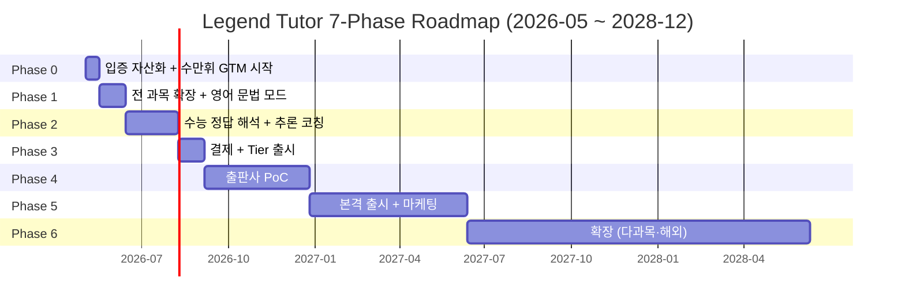

> 버전 1.1 / 작성일 2026-05-02 / Author: Architect Agent
> 관련 문서: [business-vision.md](./business-vision.md) · [pricing-strategy.md](./pricing-strategy.md) · [architecture-platform.md](./architecture-platform.md) · [research_raw.md](./research_raw.md) · [implementation_plan_phase0.md](./implementation_plan_phase0.md)
> v1.1 변경 요약: business-vision/pricing v1.1 정정사항 반영 (콴다 = 답 검색 / 우리 = why 코칭, 단과 1자리 framing, Bull = 인강 거인 역전) / Phase 0 implementation plan 링크 추가

# Roadmap — Phase 0 ~ 6 분기별 실행 계획

## 한 눈에 보기



### 의존성 그래프

```
Phase 0 (입증·GTM seed) ──┐
                          ├──→ Phase 1 (5과목 확장)
Trigger 라이브러리 일반화 ──┘                  │
                                              ▼
                                        Phase 2 (수능 정답 해석 + 메타인지)
                                              │
                                              ▼
                                        Phase 3 (결제 + Tier 출시)
                                              │
                                              ├──→ Phase 4 (출판사 PoC) ──┐
                                              │                            │
                                              ▼                            ▼
                                        Phase 5 (본격 출시 + 마케팅 + 1차 채용)
                                                                           │
                                                                           ▼
                                                                  Phase 6 (해외·다과목·풀팀)
```

---

## Phase 0 — 입증 자산화 + 수만휘 GTM 시작

### 목표
현재 운영 중인 자산 (Legend Tutor KPI 89.5%, Trigger 라이브러리 244 도구, 가드레일 9, 베타 1명 검증) 을 **마케팅·GTM 자산** 으로 변환하고, 수만휘 정회원 자격을 가진 베타 사용자 5명에게 30일 무료 체험을 시작한다.

### 기간
**2주 (2026-05-02 ~ 2026-05-16)**

### 의존성
- 현재 production 운영 중 (https://vibe-coding-contest.vercel.app)
- 13차 세션 베타 운영 인프라 (30일 만료 + admin 가드 + 가드레일 9)
- 13차 세션 G-05 KPI 89.5% 결과

### 주요 산출물

1. **마케팅 랜딩 페이지** (`/landing`)
   - KPI 89.5% 강조 + 5거장 페르소나 시각화
   - "수능 D-Day 챌린지" 무료 30일 CTA
   - 부모용 ROI 계산기 (간단 버전)

2. **수만휘·오르비 후기 게시 가이드 PDF**
   - 베타 5명에게 배포
   - "사용 일지 양식" + "광고성 표현 회피 가이드"
   - 강요 X, 자율 게시

3. **Trigger 라이브러리 영어 문법 PoC**
   - 수학 6 anchor → 영어 문법 6 anchor 시드 추가
   - 영문법 50개 도구 시드 (시제·관계대명사·수동태 등)
   - 임베딩 자동 생성

4. **베타 5명 모집 + 온보딩 자동화**
   - 슬랙·인스타로 수만휘 정회원 모집
   - 가입 → 가드레일 동의 → 30일 만료 자동 부여
   - 첫 7일 일일 사용 알림

### 검증 KPI

| 지표 | 목표 |
|---|---|
| 베타 5명 가입 완료 | 100% (5/5) |
| 베타 5명 30일 사용 완료율 | ≥ 80% (4/5) |
| 수만휘 자발 후기 게시 | ≥ 1건 |
| 오르비 자발 후기 게시 | ≥ 1건 |
| 텐볼스토리 회신 | ≥ 1건 |
| 영문법 PoC 50 도구 시드 완료 | 100% |

### 리스크

| 리스크 | 대응 |
|---|---|
| 수만휘 자발 후기 0건 | 텐볼스토리 정식 제휴 협상 우선 전환 |
| 베타 사용자 30일 미완료 | 사용 일지 1:1 코칭 (운영 직접 개입) |
| 영문법 PoC 임베딩 품질 낮음 | Phase 1 에서 6 anchor 재정의 |

---

## Phase 1 — 전 과목 확장 + 영어 문법 모드

### 목표
소크라테스 튜터를 중·고등 분리한 뒤 5과목 (수학·국어·영어·사회·과학) 으로 확장하고, **영어 문법 강의 모드** 를 출시한다. 영어 문법은 출판사 라이선스 PoC 의 1순위 후보 영역이기도 하다.

### 기간
**4주 (2026-05-17 ~ 2026-06-13)**

### 의존성
- Phase 0 영문법 PoC (6 anchor + 50 도구)
- 현재 16 도구 인프라
- Trigger 라이브러리 데이터 스키마 ([architecture-platform.md](./architecture-platform.md) §4)

### 주요 산출물

1. **소크라테스 튜터 중·고등 분리** (`/socratic/middle`, `/socratic/high`)
   - 학년별 과정 + 난이도 자동 조정
   - 중학생: 만 14세 미만 부모 동의 안내 (결제는 Phase 3)

2. **5과목 확장**
   - 수학 (기존 Legend Tutor 유지)
   - 국어: 6 anchor (현대시·고전·비문학·작문·문법·매체)
   - 영어: 문법 모드 + 독해 모드 분리
   - 사회: 한국사·통합사회·경제·정치
   - 과학: 통합과학·물리·화학·생명·지구

3. **영어 문법 강의 모드** (`/english/grammar/lecture`)
   - AI 인강 스타일 (강의 영상 없이 텍스트 + 도식)
   - 챕터 단위 진행 + 챕터 종료 시 R1 풀이 정리 카드 발급
   - 5거장 페르소나 중 라이프니츠 (표기 설계) 호출

4. **각 과목 6 anchor seed**
   - 5과목 × 6 anchor = 30 anchor 추가
   - candidate_triggers 큐에 자동 누적 시작

### 검증 KPI

| 지표 | 목표 |
|---|---|
| 5과목 전부 1턴 호출 가능 | 100% |
| 영어 문법 인강 챕터 50개 발급 | 100% |
| 각 과목 anchor 6개 + 시드 도구 30개 | 5과목 × 36 = 180 |
| 베타 사용자 사용 과목 수 | 평균 ≥ 2.5 / 학생 |
| 기존 수학 KPI 유지 | ≥ 85% |

### 리스크

| 리스크 | 대응 |
|---|---|
| 비수학 과목 KPI 낮음 (Trigger 부족) | candidate_triggers 우선 검수 + 거장 페르소나 추가 매핑 |
| 영문법 인강 토큰 비용 폭증 | Caching 60% 적용 + 챕터 단위 prompt 분리 |
| 중·고등 분리 UX 혼란 | 가입 시 학년 선택 → 자동 라우팅 |

---

## Phase 2 — 수능 정답 해석 + 추론 코칭

### 목표
**Trigger 라이브러리를 전 과목 일반화** 하고, 수능 5년치 본문 OCR + 정답 명제화 + 메타인지 카드를 출시한다. 이 단계가 우리 차별화의 핵심 — "왜 이 답이 정답인지" 명료화.

### 기간
**8주 (2026-06-14 ~ 2026-08-08)**

### 의존성
- Phase 1 5과목 anchor 완료
- Mathpix 파이프라인 (현재 사용 중) → 다른 과목 OCR 확장
- Trigger 자동 누적 인프라 (G-03 chain miss 인프라 활용)

### 주요 산출물

1. **수능 5년치 본문 OCR** (5년 × 5과목 + 한국사 + 통합사회 = 35 시험)
   - Mathpix (수학·과학) + Upstage (국어·영어 텍스트) + Vision (이미지·도식) 파이프라인
   - chapter / question / answer / explanation 구조로 DB 저장 (textbooks 테이블 사전 준비)

2. **정답 명제화 카드** (R1 schema 1.5 — 수능 본문 특화)
   - 각 정답에 대해 "왜 정답인가?" 의 Trigger 명제 자동 추출
   - 거장 페르소나가 학생 풀이 비교 → 차이점 시각화

3. **메타인지 카드** (전 과목)
   - 학생이 한 문제를 풀고 나면 "어떤 사고 도구를 썼나?" 자동 분류
   - 누적 메타인지 패턴 → 강점·약점 시각화

4. **Trigger 라이브러리 일반화 — subject_anchor 컬럼 추가**
   - 현재 단일 도메인 (수학) → 5과목 분리
   - 도구 244 → 800+ 확장 (5과목 평균 160)
   - 검수 큐 (admin) UX 개선

### 검증 KPI

| 지표 | 목표 |
|---|---|
| 수능 5년치 OCR 완료 | 35 시험 / 35 시험 (100%) |
| 정답 명제화 카드 자동 생성률 | ≥ 90% (수동 검수 10% 이내) |
| 메타인지 카드 발급 | 학생당 평균 ≥ 5 카드/주 |
| Trigger 도구 누적 | 800+ |
| 비수학 과목 KPI | ≥ 80% |
| 베타 사용자 만족도 (NPS) | ≥ 50 |

### 리스크

| 리스크 | 대응 |
|---|---|
| OCR 품질 저하 (그림·도식) | Mathpix 우선 + Vision fallback 2단계 |
| 정답 명제화 자동 추출 정확도 낮음 | 운영팀 수동 검수 큐 (admin UX) |
| 토큰 비용 급증 (5년치 학습) | Batch API 50% 할인 + 야간 시간대 처리 |
| 저작권 (수능 기출 본문) | 한국교육과정평가원 공식 자료 활용 (저작권 자유) |

---

## Phase 3 — 결제 + Tier 출시

### 목표
Toss Payments + 카카오페이 결제를 통합하고 **Lite ₩50,000 + Standard ₩150,000 두 tier 만 출시** 한다. Pro 는 사용 데이터 관찰 후 Phase 5 에 출시한다.

### 기간
**4주 (2026-08-09 ~ 2026-09-05)**

### 의존성
- Phase 2 메타인지 카드·정답 명제화 완료 (Standard 핵심 가치)
- 베타 데이터 (5~50명) 누적
- 만 14세 미만 부모 동의 플로우 ([architecture-platform.md](./architecture-platform.md) §7)

### 주요 산출물

1. **Toss Payments 통합**
   - 정기결제 + 환불 처리 + webhook 처리
   - subscriptions 테이블 + tier_id 즉시 반영 (모델 라우팅 연동)

2. **카카오페이 보조 통합**
   - 14~18세 틴즈넘버 지원 (월 ₩100만 한도 → Standard 결제 가능)
   - 카카오 로그인 통합 (가입 1step 단축)

3. **부모 동의 플로우 5단계**
   - 만 14세 미만 자동 감지 → 부모 본인인증 → 부모 카드 등록 → 가입 완료
   - parent_consent 테이블

4. **2 Tier UX**
   - Free (14일 자동 만료)
   - Lite ₩50,000 (Haiku 80% + Sonnet 20%, 1일 100턴)
   - Standard ₩150,000 (Haiku 50% + Sonnet 40% + Opus 10%, 무제한 + 부모 리포트)

5. **부모 리포트 v1**
   - 월간 PDF 자동 발송
   - 학습 시간 / 풀이 수 / 강점·약점 / 위기 신호

6. **베타 → 유료 전환 캠페인**
   - 베타 30일 만료 → "Lite 첫 달 50% 할인 ₩25,000" 오퍼
   - 학원 추천 코드 (학원장 5,000원 환급)

### 검증 KPI

| 지표 | 목표 |
|---|---|
| Toss + 카카오페이 결제 성공률 | ≥ 99% |
| 부모 동의 플로우 완료율 | ≥ 70% (시작 → 완료) |
| 베타 → 유료 전환율 | ≥ 30% |
| 누적 유료 사용자 | ≥ 100명 (Phase 3 종료 시점) |
| 환불율 | ≤ 5% |
| Standard 점유율 | ≥ 30% (vs Lite 70%) |

### 리스크

| 리스크 | 대응 |
|---|---|
| 부모 결제 거부 (만 14세 미만) | 고2~3 (만 16~18세) 우선 마케팅 |
| Toss webhook 지연 | 사용자에게 즉시 "결제 처리 중" UX + 5분 후 재확인 |
| 부모 리포트 PDF 생성 비용 | 월 1회 야간 batch 처리 (토큰 ₩200/학생/월) |
| Lite 가격 너무 비쌈 (학생 자발 결제 안 됨) | Phase 3 종료 후 ₩30,000 으로 인하 검토 ([pricing-strategy.md](./pricing-strategy.md) §6-3) |

---

## Phase 4 — 출판사 PoC

### 목표
천재교육·동아출판·비상교육 중 1~2개 사와 미팅을 진행하고, **PoC 1권** (영어 문법 또는 수학 1단원) 라이선스 합의를 도출한다. 이 Phase 가 향후 사업 확장의 핵심 인플렉션 포인트.

### 기간
**12 ~ 16주 (2026-09-06 ~ 2026-12-26)**

### 의존성
- Phase 3 결제 출시 + 유료 사용자 100명+
- Phase 2 정답 명제화 + 메타인지 카드 (출판사에 보여줄 차별화 데모)
- 법무 자문 (1차 채용 또는 외주)

### 주요 산출물

1. **출판사 미팅 자료**
   - 우리 KPI 89.5% + Trigger 라이브러리 데모
   - 학생 풀이 데이터 → 출판사 통계 대시보드 mockup
   - 분배율 제안 (플랫폼 70% / 출판사 30% baseline)

2. **PoC 1권 (영어 문법 또는 수학 1단원)**
   - 출판사 콘텐츠 OCR + Trigger 매핑
   - AI 인강 모드 + AI 코칭 모드 통합 데모
   - 30~50명 학생 대상 3개월 사용

3. **textbooks 테이블 v1** ([architecture-platform.md](./architecture-platform.md) §2)
   - publisher_id / isbn / chapter / ocr_text / license_terms / drm_token
   - chapter-level signed URL + watermark

4. **출판사 통계 대시보드 v1**
   - 월간 학생 사용량 + 챕터별 풀이율
   - 약점 챕터 자동 식별 → 교재 개선 인사이트

5. **법무·계약 인프라**
   - 라이선스 계약서 템플릿
   - DRM·저작권 보호 정책
   - 분배율 자동 계산 + 정산

### 검증 KPI

| 지표 | 목표 |
|---|---|
| 출판사 미팅 진행 | ≥ 3사 |
| PoC 합의 | ≥ 1건 |
| PoC 학생 사용 만족도 (NPS) | ≥ 60 |
| PoC 학생 학습 효과 (모의고사 점수 상승) | ≥ +5점 평균 |
| 정식 계약 협상 진입 | ≥ 1건 |

### 리스크

| 리스크 | 대응 |
|---|---|
| 출판사 미팅 자체 거부 | 학원 채널 우회 진입 (학원이 출판사에 추천) |
| 분배율 협상 결렬 (출판사 50%+ 요구) | 자체 콘텐츠 제작팀 검토 (Plan B) |
| DRM 우회 사례 | watermark + 사용자 식별 + 법적 대응 |
| PoC 학생 학습 효과 미증명 | 베타 + Phase 3 데이터 사전 누적 |

---

## Phase 5 — 본격 출시 + 마케팅 + 1차 채용

### 목표
정식 출시 마케팅을 본격 가동하고 **풀타임 팀 5명+** 를 구성한다. Pro tier 를 출시하고 학원 가맹·인플루언서 협업을 확대한다.

### 기간
**24주 (2026-12-27 ~ 2027-06-12)**

### 의존성
- Phase 4 출판사 PoC 데이터
- Phase 3 결제 인프라 안정화
- 자본 확보 (시리즈 A 또는 자체 ARR)

### 주요 산출물

1. **Pro Tier 출시 (₩300,000/월)**
   - Haiku 30% + Sonnet 50% + Opus 20% + Gemini 3.1 Pro agentic
   - 출판사 콘텐츠 우선 액세스 (Phase 4 PoC 결과 반영)
   - 학원 매칭 + 1:1 멘토링

2. **Family Tier 출시 (₩400,000/월, 자녀 2명)**

3. **인플루언서 마케팅** (예산 1억+)
   - 입시 유튜버 10~20명 협찬
   - 인스타·틱톡 광고 + 자체 SNS 콘텐츠팀

4. **학원 가맹·직영 확대**
   - 직영 5개 + 가맹 30개+
   - 학원 운영 도구 (Academy Tier) 출시

5. **1차 채용**
   - 풀타임 개발자 3명 (Frontend / Backend / AI)
   - UX 디자이너 1명
   - 콘텐츠 운영 2명
   - 법무·사업개발 1명 (출판사 협상)

6. **출판사 정식 계약 1건+**
   - PoC 결과 기반 정식 계약 체결
   - 다음 출판사 PoC 동시 진행

### 검증 KPI

| 지표 | 목표 |
|---|---|
| 누적 유료 사용자 | ≥ 10,000 |
| Pro 점유율 | ≥ 15% (1,500명+) |
| ARR | ≥ ₩30억 |
| 마진율 | ≥ 70% |
| 출판사 정식 계약 | ≥ 1건 |
| 학원 가맹 | ≥ 30개 |
| 풀타임 팀 | 5명+ |
| NPS | ≥ 60 |

### 리스크

| 리스크 | 대응 |
|---|---|
| 인플루언서 마케팅 ROI 낮음 | 채널별 LTV 추적 + 단계적 예산 조정 |
| 1차 채용 인재 확보 실패 | 시니어 freelancer 6개월 계약으로 우회 |
| 학원 가맹 분쟁 (수수료·콘텐츠) | 표준 계약서 + 분쟁 조정 절차 사전 마련 |
| Pro 사용자 토큰 비용 폭증 | Cost Guard 4단계 ([pricing-strategy.md](./pricing-strategy.md) §3-4) |

---

## Phase 6 — 확장 (장기, 2027 Q3 ~ 2028 Q4)

### 목표
다과목 출판사 라이선스 + 학원 50개+ + 해외 시장 (베트남·일본) 진출.

### 기간
**12 ~ 18개월 (2027-06-13 ~ 2028-12-31)**

### 의존성
- Phase 5 결과 (ARR ₩30~50억 + 출판사 1건)

### 주요 산출물

1. **다과목 라이선스 확장**
   - 천재 + 동아 + 비상 동시 운영
   - 출판사 5사 이상 계약

2. **학원 가맹 확장 (목표 100개+)**
   - 가맹 운영 본부 신설
   - 지역별 가맹 매니저 채용

3. **해외 시장 진출 (Bull 시나리오)**
   - 베트남 (콴다 글로벌 진출 사례 활용)
   - 일본 (수험·학원 시장 한국과 유사)
   - 영어 글로벌 버전 (Khanmigo 대안)

4. **풀타임 팀 20명+**
   - AI 연구팀 5명 (Trigger 라이브러리 R&D)
   - 콘텐츠 운영 5명
   - 해외 사업 2명

5. **시리즈 B 펀딩 또는 자체 흑자**

### 검증 KPI

| 지표 | Bull (2028 말) | Base (2028 말) |
|---|---|---|
| 누적 유료 사용자 | 100,000+ | 50,000 |
| ARR | ₩200~300억 | ₩30~50억 |
| 출판사 계약 | 5사+ | 2~3사 |
| 학원 가맹 | 100개+ | 30~50개 |
| 풀타임 팀 | 30명+ | 10~15명 |
| 해외 진출 | 2개국+ | 0~1개국 |

### 리스크

| 리스크 | 대응 |
|---|---|
| 해외 진출 실패 (현지 경쟁) | Phase 6 후반부에 진행, 한국 1위 확보 후 |
| 학원 가맹 본부 운영 미숙 | 외부 가맹 운영 전문가 영입 |
| 콴다·EBS 카테고리 직접 진입 | Trigger 라이브러리 50만+ 데이터 해자로 방어 |

---

## 종합 우선순위 매트릭스

각 Phase 의 작업을 임팩트(Impact) × 노력(Effort) 매트릭스로 정렬.

```
                       ↑ 임팩트 (Impact)
       매우 큼
              │
   ★ Trigger 영문법 PoC (P0)        ★ 출판사 PoC (P4)
   ★ 베타 5명 모집 (P0)             ★ 결제 인프라 (P3)
   ★ KPI 89.5% 마케팅 (P0)
              │
   ★ 5과목 확장 (P1)                ★ Pro Tier 출시 (P5)
   ★ 영문법 인강 (P1)               ★ 부모 리포트 (P3)
       중간   │
              │
   ★ 메타인지 카드 (P2)             ★ 인플루언서 마케팅 (P5)
   ★ 정답 명제화 (P2)               ★ 학원 가맹 (P5)
              │
              │
   ★ 수능 5년치 OCR (P2)            ★ 해외 진출 (P6)
       작음   │
              │
              │
              └────────────────────────────────────→ 노력 (Effort)
              작음              중간              매우 큼
```

**핵심 우선순위 (즉시 실행)**:
1. Phase 0 — KPI 89.5% 마케팅 자료화 + 베타 5명 모집 (2주)
2. Phase 1 — 영문법 모드 출시 (4주)
3. Phase 3 — 결제 출시 (Phase 2 후 4주, 우선순위 높음)
4. Phase 4 — 출판사 PoC (사업 확장 핵심)

---

## 종료 조건 / Pivot 트리거

| 시점 | 트리거 | Pivot |
|---|---|---|
| Phase 0 4주 후 | 자발 후기 0건 | 텐볼스토리 정식 제휴 우선 |
| Phase 1 종료 | 5과목 KPI 평균 < 70% | 영어 문법 단일 과목 특화로 재포지션 |
| Phase 3 3개월 후 | 유료 전환율 < 5% | Lite ₩30,000 인하 + Free 30일 연장 |
| Phase 4 6개월 후 | 출판사 PoC 0건 | 자체 콘텐츠팀 구성 (콘텐츠 운영 2명 채용) |
| Phase 5 6개월 후 | ARR < ₩10억 | Pro 가격 ₩200,000 인하 검토 + 학원 채널 집중 |

---

## 부록 A. 분기별 마일스톤 (Base 시나리오)

| 분기 | Phase | 주요 산출물 | 누적 유료 사용자 |
|---|---|---|---|
| 2026 Q2 | P0 → P1 시작 | 베타 5명, 영문법 PoC | 0 |
| 2026 Q3 | P1 → P2 시작 | 5과목 확장 | 0 (베타) |
| 2026 Q4 | P2 → P3 | 수능 OCR 5년치 + 결제 출시 | 100 |
| 2027 Q1 | P3 → P4 시작 | 부모 리포트 + 출판사 미팅 | 1,000 |
| 2027 Q2 | P4 → P5 시작 | PoC 합의 + Pro 출시 | 5,000 |
| 2027 Q3 | P5 | 인플루언서 + 1차 채용 | 10,000 |
| 2027 Q4 | P5 | 학원 가맹 10개 | 20,000 |
| 2028 Q1 | P5 → P6 | 출판사 정식 계약 1건 | 30,000 |
| 2028 Q2 | P6 | 해외 진출 검토 | 40,000 |
| 2028 Q3~Q4 | P6 | 해외 진출 PoC | 50,000 |

## 부록 B. Phase 별 예산 추정 (Base 시나리오)

| Phase | 기간 | 토큰 비용 | 마케팅 | 인건비 | 총 |
|---|---|---|---|---|---|
| P0 | 2주 | ₩100,000 | 0 | 0 (1인) | ~₩100K |
| P1 | 4주 | ₩2,000,000 | 0 | 0 (1인) | ~₩2M |
| P2 | 8주 | ₩10,000,000 (OCR + 학습) | 0 | 0 (1인) | ~₩10M |
| P3 | 4주 | ₩5,000,000 | ₩5,000,000 | 0 (1인) | ~₩10M |
| P4 | 16주 | ₩30,000,000 | ₩10,000,000 | ₩50,000,000 (법무·사업개발) | ~₩90M |
| P5 | 24주 | ₩200,000,000 | ₩100,000,000 | ₩300,000,000 (5명+) | ~₩600M |
| P6 | 18개월 | ₩1,000,000,000 | ₩500,000,000 | ₩2,000,000,000+ | ~₩3.5B+ |

(P5 이후는 ARR 자체 매출로 충당. P0~P4 는 기존 자본 또는 시리즈 시드.)
